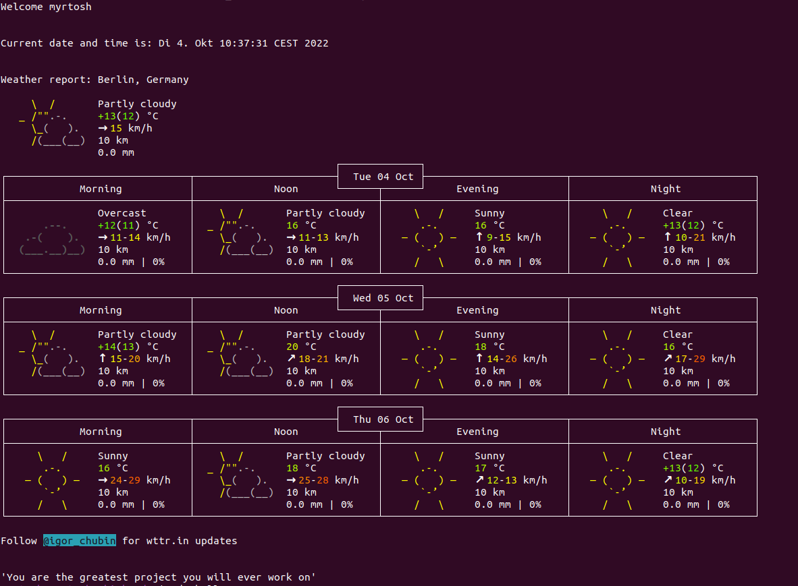

# Welcome Script

 A small script that welcomes the currently logged in user 
 

  displays the current date, time and weather forecast 
 

  and ends with an inspirational quote. 
 

--- 

#### Getting started:
- Clone the repository
- Run the script `./welcome.sh`
- To make the script run everytime a new terminal opens add the full path to the script to the end of `~/.zshrc`

##### If you're using bash or another terminal you need to adjust the shebang and configuration file that contains the commands that run your shell accordingly.